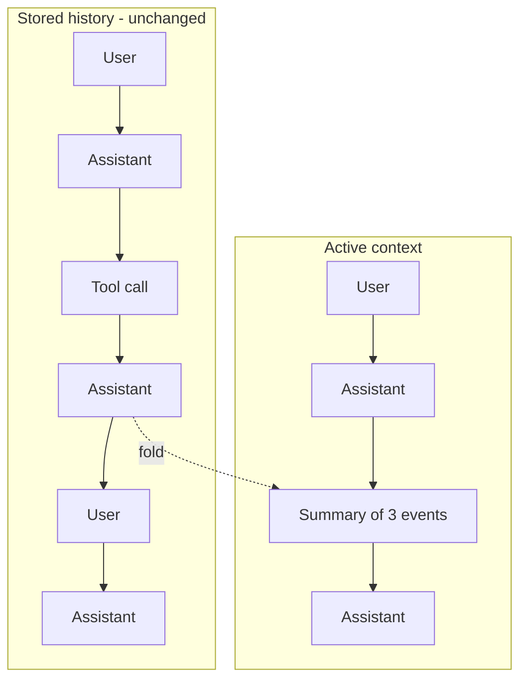

# pi-infinite-context

*This readme is fully human-written.*

This [pi](https://pi.dev/) extension enables an infinite context experience for agentic chat sessions. It provides tools for the agent to collapse and summarize arbitrary parts of its history. Summarized content is not lost. It can still be searched and expanded on demand. This is a more fine-grained alternative to auto compaction which is currently implemented in many harnesses.



This turned out to work surprisingly well with claude-opus-4/5 and gpt-5.6-sol models. I usually have a single chat per project and use it to work through many more tasks than would be possible with limited context. I rarely notice any task performance / understanding degradation.


## Install

```bash
pi install git:github.com/fdietze/pi-infinite-context
```

## License

[MIT](LICENSE)
