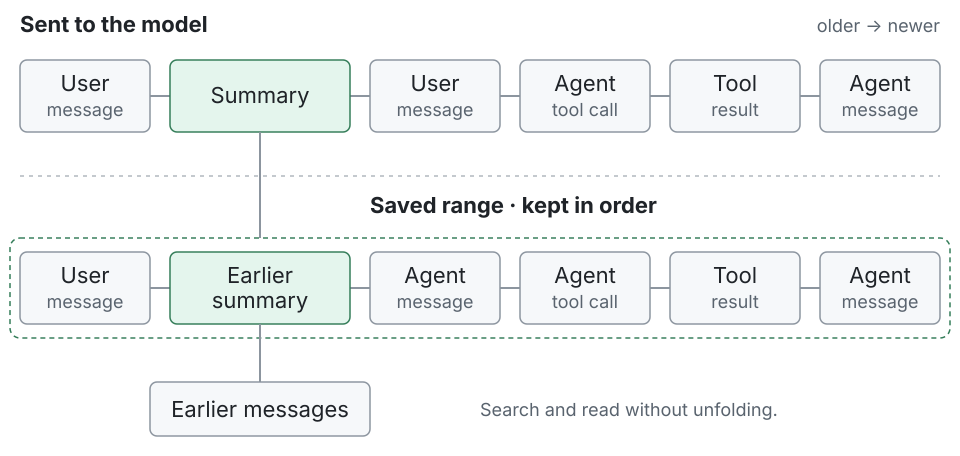

# pi-infinite-context

Keep working in one [Pi](https://pi.dev/) session for longer. The agent replaces old work in its context with short summaries. The original messages stay saved and searchable.

## How it works

1. **Fold:** The agent groups a stretch of its context into a **fold** and writes a summary. The model sees that summary instead of the messages inside.
2. **Fold again:** A new fold can contain earlier folds and more messages. Their summaries and original messages stay intact.
3. **Find:** The agent can search the archive and read what it needs. Reading does not unfold anything or change the fold tree.



The archive belongs to the current session branch. Folding changes what is sent to the model, not the chat history shown in Pi.

## Tools

The agent uses these five tools:

| Tool | What it does |
| --- | --- |
| `context_fold` | Groups a stretch of visible context into a fold with a new summary. |
| `context_summary` | Rewrites the summary of a visible fold, without changing its contents. |
| `context_map` | Lists the visible context, or the direct contents of one fold. |
| `context_search` | Searches original messages and fold summaries using regular expressions. |
| `context_peek` | Reads one original message or fold summary by ID, with an optional line range. |

Map and search results provide the IDs to read next. Reading returns up to 100 lines by default and reports the total line count. Large tool outputs are limited. Read results also use context space, so the agent should read only what it needs.

## Context reminders

When Pi estimates that context is at least **75% full**, the extension sends the agent a visible **context nudge** during ongoing tool work. It asks the agent to fold completed work while keeping the current task, open questions, errors, and useful evidence. It reminds the agent again if usage keeps rising.

The reminder does not fold anything itself. The agent chooses what to fold and writes the summaries.

## Limits

This extension does not enlarge the model's context window. Summaries can leave out details; the agent may need to find them in the archive later.

There is no `unfold` tool. Pi's own compaction is blocked, including `/compact`. If the agent does not fold enough in time, a context overflow remains an error rather than triggering another kind of summary.

## Install

```bash
pi install git:github.com/fdietze/pi-infinite-context
```

Start a new session after installing. Sessions with old extension data or earlier Pi compaction are not supported.

## Development

```bash
nix develop -c npm ci
nix develop -c npm run ci
```

See [DESIGN.md](DESIGN.md) for the data model and exact tool rules.

## License

[MIT](LICENSE)
